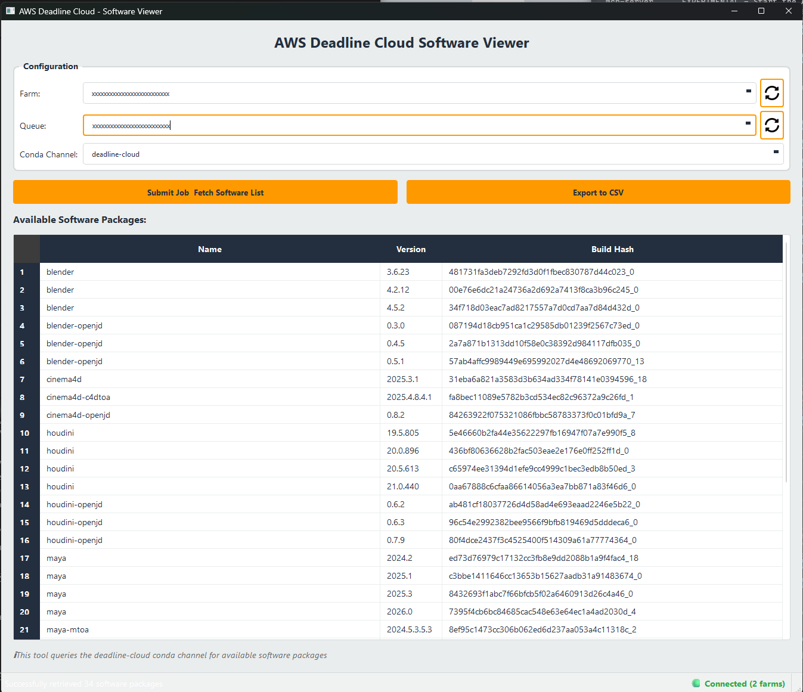

# AWS Deadline Cloud Software Viewer - GUI Application

A modern Python Qt desktop application for querying and displaying available software packages from AWS Deadline Cloud.



## Features

**Modern Qt Interface** - Clean, professional design with intuitive controls  
**Automated Job Submission** - Submit jobs and monitor completion automatically  
**Data Display** - View software packages in an organized table with Name, Version, and Build Hash  
**CSV Export** - Export data for reporting and analysis  
**Persistent Settings** - Saves your Farm and Queue IDs for convenience  
**Progress Tracking** - Real-time status updates and progress bar  

## Prerequisites

- **Python 3.8 or higher**
- **AWS Deadline Cloud CLI** - `pip install deadline[gui]`
- **AWS Credentials** - Configured via `aws configure`
- **PyQt6** - Installed automatically via requirements

## Installation

### Quick Install

Run the installation script which will check all requirements and install dependencies:

```bash
python install.py
```

### Manual Installation

1. **Install Python dependencies:**
   ```bash
   pip install -r requirements.txt
   ```

2. **Install AWS Deadline Cloud CLI:**
   ```bash
   pip install deadline[gui]
   ```

3. **Configure AWS credentials:**
   ```bash
   aws configure
   ```

## Usage

### Running the Application

```bash
python deadline_software_viewer.py
```

Or on Windows, you can double-click `deadline_software_viewer.py` if Python is associated with `.py` files.

### Using the Application

1. **Enter Your Configuration:**
   - **Farm ID**: Your AWS Deadline Cloud farm ID (format: `farm-xxxxxxxx`)
   - **Queue ID**: Your AWS Deadline Cloud queue ID (format: `queue-xxxxxxxxxxxx`)
   
    *Tip: These values are saved automatically and will be pre-filled on next launch*

2. **Find Your Farm and Queue IDs:**
   ```bash
   # List available farms
   deadline farm list
   
   # List queues for a specific farm
   deadline queue list --farm-id farm-xxxxxxxx
   ```

3. **Submit Job & Fetch Data:**
   - Click the **" Submit Job & Fetch Software List"** button
   - The application will:
     - Submit the job to AWS Deadline Cloud
     - Monitor the job until completion
     - Retrieve and parse the results
     - Display the software packages in the table

4. **Export Results:**
   - Once data is loaded, click **" Export to CSV"**
   - Choose a location to save the CSV file
   - File includes Name, Version, and Build Hash columns

## Application Architecture

### Components

```
deadline_software_viewer.py
├── MainWindow              # Main GUI window
├── JobSubmitter            # Background thread for AWS operations
├── SoftwareParser          # Parse conda output data
└── Qt Widgets              # Tables, buttons, progress bars
```

### How It Works

1. **Job Submission**: Uses `deadline bundle submit` to submit the job template
2. **Monitoring**: Polls job status every 5 seconds using `deadline job get`
3. **Log Retrieval**: Fetches job logs using `deadline job logs`
4. **Parsing**: Extracts software info using regex pattern matching
5. **Display**: Populates Qt table with parsed data

## Features in Detail

### Configuration Management

- **Auto-save**: Farm and Queue IDs are automatically saved to `~/.deadline_software_viewer.json`
- **Validation**: Input validation ensures proper ID formats
- **Persistence**: Settings persist across application sessions

### Job Management

- **Background Processing**: Job submission and monitoring run in a separate thread
- **Progress Updates**: Real-time status messages and progress bar
- **Error Handling**: Clear error messages with troubleshooting information
- **Timeout Protection**: 5-minute maximum wait time with appropriate error handling

### Data Display

- **Sortable Table**: Click column headers to sort data
- **Row Selection**: Select rows to highlight data
- **Alternating Colors**: Easy-to-read alternating row colors
- **Responsive Layout**: Table columns auto-adjust to content

### Export Functionality

- **CSV Format**: Standard CSV with headers
- **Timestamped Files**: Default filename includes date and time
- **Custom Location**: Choose where to save exported files

## Troubleshooting

### "Module not found" Error

**Problem**: `ModuleNotFoundError: No module named 'PyQt6'`

**Solution**:
```bash
pip install -r requirements.txt
```

### "deadline: command not found"

**Problem**: AWS Deadline Cloud CLI is not installed

**Solution**:
```bash
pip install deadline[gui]
```

### "Authentication Error"

**Problem**: AWS credentials are not configured

**Solution**:
```bash
aws configure
# Enter your AWS Access Key ID, Secret Access Key, and region
```

### "Bundle directory not found"

**Problem**: The `list_software/` directory is missing

**Solution**: Ensure the directory structure is intact:
```
project/
├── deadline_software_viewer.py
├── requirements.txt
├── install.py
└── list_software/
    └── template.yaml
```

### "Job Timeout"

**Problem**: Job exceeded 5-minute maximum wait time

**Possible Causes**:
- No available workers in the queue
- Worker nodes are busy with other jobs
- Network connectivity issues

**Solution**:
- Check queue status: `deadline queue get --farm-id <farm-id> --queue-id <queue-id>`
- Verify workers are available and healthy
- Check AWS Deadline Cloud console for queue status

### "No software packages found"

**Problem**: Job completed but no data was parsed

**Possible Causes**:
- Job failed to execute conda search command
- Output format changed
- Conda not available on worker nodes

**Solution**:
- Check job logs manually: `deadline job logs --farm-id <farm-id> --queue-id <queue-id> --job-id <job-id>`
- Verify conda is installed on worker nodes
- Check that the deadline-cloud conda channel is accessible

## Keyboard Shortcuts

- **Enter**: Submit job (when focus is on Farm or Queue ID fields)
- **Ctrl+Q**: Quit application
- **Ctrl+C**: Copy selected table cells

## Configuration File Location

Settings are stored in your home directory:
- **Windows**: `C:\Users\<username>\.deadline_software_viewer.json`
- **macOS**: `/Users/<username>/.deadline_software_viewer.json`
- **Linux**: `/home/<username>/.deadline_software_viewer.json`

## Technical Details

### Dependencies

- **PyQt6**: Modern Qt6 bindings for Python
- **AWS Deadline Cloud CLI**: For job submission and monitoring
- **Python Standard Library**: subprocess, json, re, pathlib

### Performance

- **Lightweight**: Minimal resource usage
- **Responsive**: UI remains responsive during long-running operations
- **Efficient**: Background threading prevents UI freezing

### Security

- **No Credentials Stored**: AWS credentials are managed by AWS CLI
- **Local Storage**: Settings file only contains Farm and Queue IDs
- **Read-only Operations**: Application only reads job logs, no destructive operations

## Development

### Project Structure

```
list_software/
├── README.md                       # Original CLI documentation
├── GUI_README.md                   # This file
├── requirements.txt                # Python dependencies
├── install.py                      # Installation script
├── deadline_software_viewer.py     # Main application
└── list_software/                  # Job bundle
    └── template.yaml               # Deadline Cloud job template
```

### Extending the Application

The application is designed to be extensible. Common enhancements:

1. **Add Search/Filter**: Filter table by software name or version
2. **Multiple Channels**: Query different conda channels
3. **Comparison Mode**: Compare software across different environments
4. **Scheduled Queries**: Automatically query at intervals
5. **Notifications**: Alert when new software versions are available

### Code Style

- Follows PEP 8 Python style guidelines
- Type hints for better code clarity
- Comprehensive docstrings
- Modular design with clear separation of concerns

## Known Limitations

- Job timeout is fixed at 5 minutes
- Only supports the deadline-cloud conda channel
- Requires manual Farm and Queue ID input (no auto-discovery)
- CSV export only (no JSON or Excel formats)

## Roadmap

Future enhancements planned:

- [ ] Dark mode theme option
- [ ] Auto-discovery of farms and queues
- [ ] Job history and caching
- [ ] Advanced filtering and search
- [ ] Multiple export formats (JSON, Excel)
- [ ] Batch job submission
- [ ] Real-time log streaming
- [ ] Software comparison tools

## Support

For issues related to:
- **This Application**: Check troubleshooting section above
- **AWS Deadline Cloud**: [AWS Deadline Cloud Documentation](https://docs.aws.amazon.com/deadline-cloud/)
- **PyQt6**: [PyQt6 Documentation](https://www.riverbankcomputing.com/static/Docs/PyQt6/)

## License

This tool is provided as-is for use with AWS Deadline Cloud.

## Version History

- **v1.0.0** (2024-12) - Initial release
  - Modern Qt6 GUI interface
  - Job submission and monitoring
  - Data parsing and display
  - CSV export functionality
  - Persistent configuration

---
